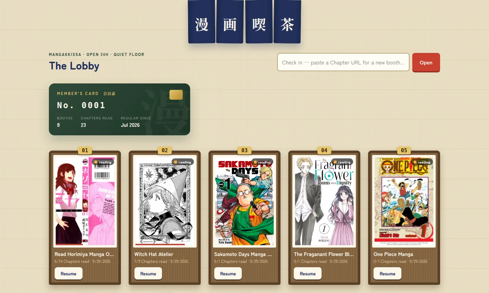
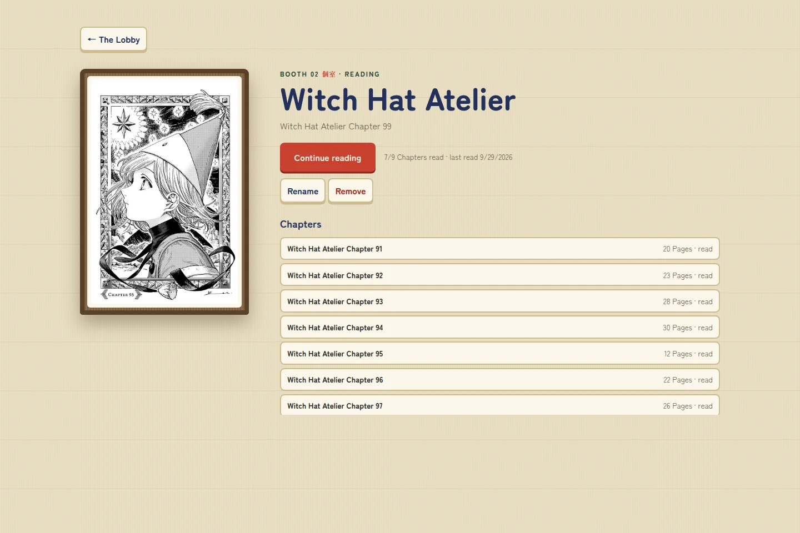
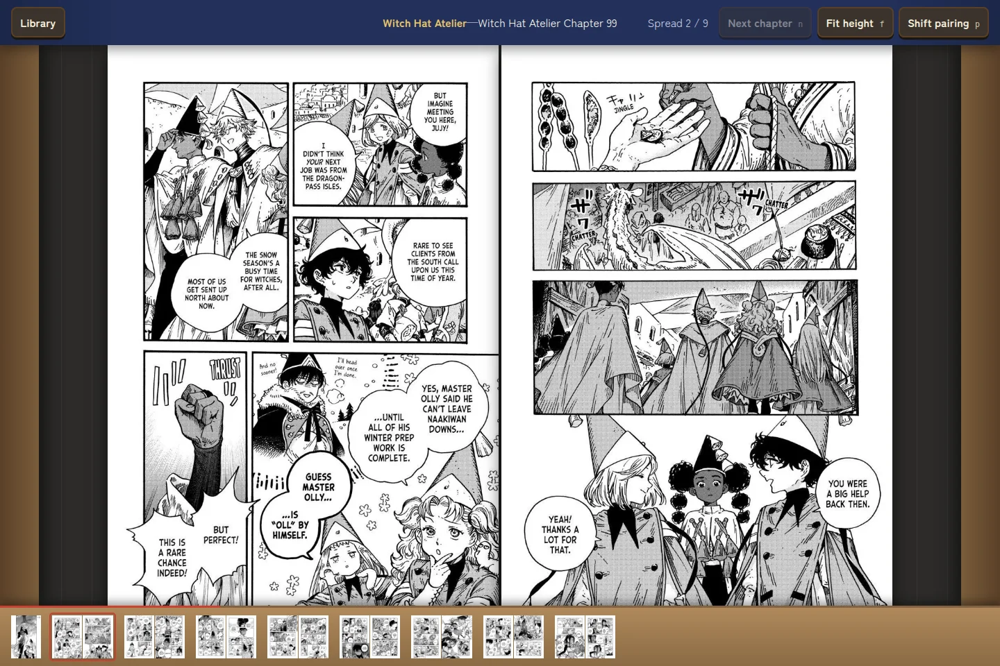
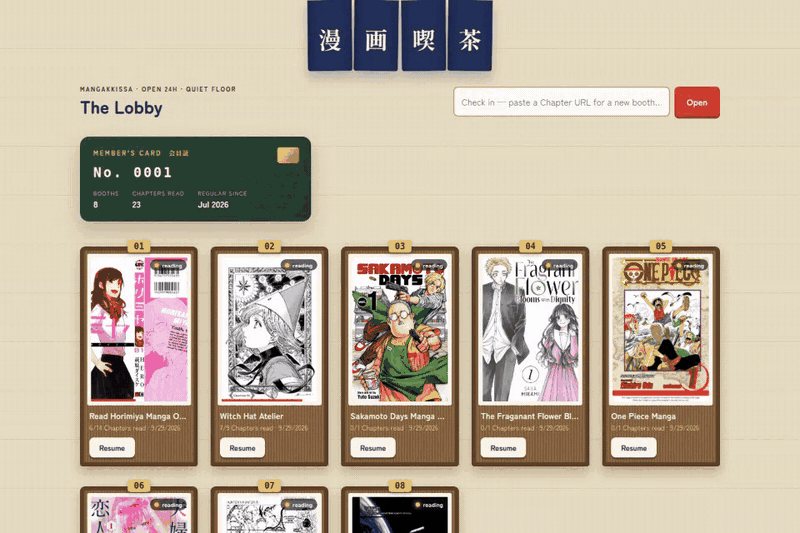

# Mangakkissa

A local, single-user manga reader. Paste a Chapter URL, read right-to-left Page Spreads, continue into adjacent Chapters, and resume Series from a persistent local Library.



**Your own manga café, open 24 hours.**

- **Paste and read.** Open a Chapter URL in a focused, right-to-left reader.
- **Keep your place.** Resume each Series from a persistent local Library with a chapter history.
- **Settle into a spread.** Browse page thumbnails, change the fit, and adjust page pairing.
- **Keep reading.** Continue into adjacent Chapters when their links are detected.

[Quick start](#quick-start) · [Adding manga](#adding-manga) · [Screenshots](#screenshots) · [Reader controls](#reader-controls) · [Limitations](#current-limitations) · [Deployment](#reverse-proxy-under-mangakkissa)

## Screenshots

| Your reading booth | The spread reader |
| --- | --- |
| [](docs/images/series.webp) | [](docs/images/reader.webp) |
| Pick up a Series and browse its visited Chapters. | Read paired Pages with a filmstrip for quick navigation. |

<details>
<summary><strong>Watch a short walkthrough</strong> — lobby → series → reader</summary>



</details>

*Captured from the running app. Manga artwork belongs to its respective creators.*

## Quick start

Requires **Node.js 20.19 or newer** and npm. From the project directory:

```sh
npm ci
npm run build
npm start
```

Open **[localhost:4173/mangakkissa/](http://localhost:4173/mangakkissa/)**, paste a Chapter URL, and start reading.

`npm ci` installs the exact dependency versions recorded in `package-lock.json`. The build creates the production client and server in `dist/`. The production app has no database, browser automation, native image libraries, or other native runtime dependencies.

## Adding manga

1. Open the manga's **chapter page** on its source website and copy its full `https://…` URL. Use the page that displays the chapter's images, rather than the site's homepage, a search result, or the series' chapter list.
2. In **The Lobby**, paste that URL into **“Check in — paste a Chapter URL for a new booth…”** and click **Open**.
3. When the chapter is successfully extracted, the reader opens and the Series is saved to your Library automatically. Its initial title comes from the source website, and its first page becomes the cover.
4. Click **Library** to return. Use **Resume** to reopen the saved chapter, or click a cover to see the Series and its chapter history.

There is no separate add/save step, built-in manga search, or file-import flow. You find chapters on the web and bring their URLs to Mangakkissa.

When a next-chapter link is detected, advancing past the final spread opens that chapter automatically; **Next chapter** or `N` also jumps to it. If no next link is found, advance to the end card and paste the next Chapter URL there. Each newly opened chapter is added to the history; the app does not import a website's entire chapter catalog or check for new releases.

On a Series screen, **Rename** changes its display title, **Change cover** lets you choose a first page from its visited Chapters, and **Remove** deletes its Library entry and chapter history after confirmation. Opening a chapter from that Series again creates a new entry.

## Current limitations

- **Series are grouped by website hostname.** The current generic extractor does not identify separate manga within a shared website. Two manga hosted on the same hostname will share a Library entry; renaming it does not split them. The same manga on different hostnames creates separate entries.
- **Resume remembers a chapter, not a page.** It points to the most recently opened chapter that was new to the history. Rereading a visited chapter leaves that pointer unchanged. Reopening starts at the first spread; reaching the final spread marks the chapter read.
- **Site compatibility varies.** The reader extracts images from the HTML returned by the source site and needs at least three qualifying consecutive page images. It does not run the source site's JavaScript or sign in, so JavaScript-only readers, login walls, and anti-bot challenges may prevent extraction. A site opening in your browser does not guarantee it will work here.
- **Designed for page-based manga.** Vertical-scroll comics are unsupported. Local PDF, CBZ, ZIP, and image-folder imports are not available.
- **Reading requires the source to remain available.** The Library saves links and reading history. Images are fetched on demand with temporary caching; adding a Series does not download it for offline reading.

If a chapter fails to open, check that you pasted the chapter's reading page and that the source is reachable. Use the error's retry action for a temporary failure. If the site consistently yields no pages, it may need a dedicated extractor. If an individual page fails, click **“Page … didn’t load — tap to retry”** in the reader.

## Library storage and backups

The Library is stored in **`library.json` at the project root** and reloaded when the server starts. It contains Series titles, cover URLs, visited Chapters, completion flags, and resume links. To back it up or move it to another installation, stop the server with `Ctrl-C` and copy this file. To restore, replace the destination's `library.json` while its server is stopped, then start it again.

All browsers and devices connected to the same server share this one Library. There are no separate accounts or built-in synchronization between independent installations.

**Use a trusted network.** The server binds to all local network interfaces by default and has no authentication. Anyone who can reach it can read and modify the Library. Use `HOST=127.0.0.1 npm start` for access only from this computer, or protect an externally reachable deployment at the reverse proxy.

## Reader controls

| Control | Action |
| --- | --- |
| `←` or `Space` | Next spread |
| `→` | Previous spread |
| `N` | Next Chapter, when available |
| `F` | Cycle fit height, fit width, and original size |
| `P` | Shift page pairing |
| Click the left / right edge | Next / previous spread |
| Click the center | Show or hide controls |
| Click a thumbnail | Jump to that spread |

## Test

```sh
npm test
```

## Start

Build first, then start the single production process:

```sh
npm start
```

The process binds to all local network interfaces and prints both the local URL and each detected LAN URL, for example:

```text
Mangakkissa local: http://127.0.0.1:4173/mangakkissa/
Mangakkissa LAN:   http://192.168.1.50:4173/mangakkissa/
```

Open the LAN URL from another device connected to the same network. If it cannot connect, allow TCP port `4173` through the computer's firewall. To use another port:

```sh
PORT=4180 npm start
```

To restrict the app to this computer again, set `HOST=127.0.0.1`:

```sh
HOST=127.0.0.1 npm start
```

## Reverse proxy under `/mangakkissa`

The production build and server default to `/mangakkissa/`, so a reverse proxy can preserve that prefix instead of rewriting it. Build and run the backend on loopback:

```sh
npm run build
HOST=127.0.0.1 npm start
```

For Nginx, proxy the prefix without a URI suffix so the upstream receives the original `/mangakkissa/...` path:

```nginx
location = /mangakkissa {
    return 308 /mangakkissa/;
}

location /mangakkissa/ {
    proxy_pass http://127.0.0.1:4173;
    proxy_set_header Host $host;
    proxy_set_header X-Forwarded-For $proxy_add_x_forwarded_for;
    proxy_set_header X-Forwarded-Proto $scheme;
    proxy_read_timeout 300s;
}
```

For Caddy, `handle` (not `handle_path`) keeps the prefix. The optional last block sends old `/manga-reader/` links to the new path:

```caddy
redir /mangakkissa /mangakkissa/ 308
handle /mangakkissa/* {
    reverse_proxy 127.0.0.1:4173
}
handle_path /manga-reader/* {
    redir * /mangakkissa{uri} 308
}
```

This exposes the reader at `https://example.com/mangakkissa/`. Query strings must be preserved because Chapter navigation and image requests carry their source URLs in query parameters. No WebSocket forwarding is required.

To use a different mount, provide the same `APP_BASE_PATH` while building and starting because Vite embeds it in the browser bundle:

```sh
APP_BASE_PATH=/reader npm run build
APP_BASE_PATH=/reader HOST=127.0.0.1 npm start
```

Set `APP_BASE_PATH=/` at both stages for a root deployment. The app has no authentication; if the proxy is reachable outside a trusted network, protect this location at the proxy.

## Optional Spread upscaling

Some Chapters ship pre-joined landscape Spreads at half the width of their neighbouring Pages, which the browser can only render blurry. If you install [waifu2x-ncnn-vulkan](https://github.com/nihui/waifu2x-ncnn-vulkan) (a standalone binary — not an npm dependency), point the reader at it:

```sh
UPSCALER_BIN=/path/to/waifu2x-ncnn-vulkan npm start
```

Deficient Spreads then render immediately as-is and swap to a sharpened 2x version once the binary finishes (a few CPU seconds, off the reading path).

On a machine without a GPU, use the **20220728** release with `-g -1` CPU mode (the 20250915 release segfaults in CPU mode), and install a Vulkan driver so the binary can start — on Debian/Ubuntu: `sudo apt-get install mesa-vulkan-drivers`. Upscaled bytes are cached in memory for the life of the process; nothing is written next to `library.json`. With `UPSCALER_BIN` unset, no upscale code path runs and the app behaves exactly as described above.

## Reproducible release check

Starting from a clean dependency install:

```sh
rm -rf node_modules dist
npm ci
npm test
npm run build
npm audit --omit=dev
npm start
```

Then open either the printed local URL or a printed LAN URL and exercise a Chapter URL. The production process must serve the Library, reader, image proxy, and built client without a second server.
